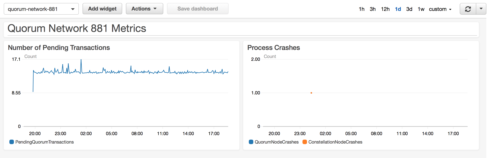

# Test 1: Initial Test
  
## Description

Tests a relatively small, multi-region network to demonstrate the functionality of the testing mechanism and demonstrate the structure of a test.

## Network Properties

### Network Size
| Property             | Value |
| :------------------: | :---: |
| Number of Regions    | 8     |
| Number of Makers     | 13    |
| Number of Validators | 7     |
| Number of Observers  | 1     |

### Network Configuration
| Property                       | Value       |
| :----------------------------: | :---------: |
| Votes to Confirm Block         | 4           |
| Gas Limit Per Block            | 804247552   |
| Block Maker Minimum Block Time | 60 seconds  |
| Block Maker Maximum Block Time | 300 seconds |

### Instance Types
| Property                  | Value     |
| :-----------------------: | :-------: |
| Quorum Node Instance Type | t2.medium |
| Bootnode Instance Type    | t2.small  |

## Test Results

### Overall

**SUCCESS**

The network is still running after almost a day of running

### Details

At any given point there are around 14 Pending transactions. The process crash metrics suggest there was a crashed process, but there is no evidence that the instance that emitted the metric had a quorum or constellation crash. It may be a bug in the event listener.

### Metrics

