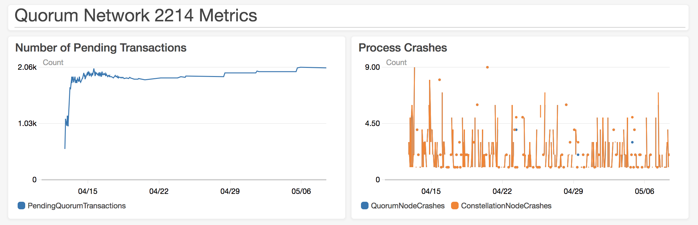

# Test 8: Bigger File System

## Description

Tests the same size network with a swapfile activated to see if we can stand up a network of this size.

## Network Properties

### Network Size
| Property             | Value |
| :------------------: | :---: |
| Number of Regions    | 14    |
| Number of Makers     | 610   |
| Number of Validators | 377   |
| Number of Observers  | 1     |

### Network Configuration
| Property                       | Value       |
| :----------------------------: | :---------: |
| Votes to Confirm Block         | 189         |
| Gas Limit Per Block            | 804247552   |
| Block Maker Minimum Block Time | 60 seconds  |
| Block Maker Maximum Block Time | 300 seconds |

### Instances
| Property                  | Value     |
| :-----------------------: | :-------: |
| Quorum Node Instance Type | t2.medium |
| Bootnode Instance Type    | t2.small  |
| Root File System Size     | 50 GB     |

## Test Results

### Overall

**FAILURE**

The network continues to produce blocks. However, a large number of nodes became out of sync and could not re-sync. We have no reason to believe this network could avoid falling over eventually.

### Details

Evidence of issues in logs copied below.

```
I0419 19:52:44.245039 eth/downloader/downloader.go:305] Synchronisation failed: state data download canceled (requested)
I0419 19:52:50.525836 core/quorum/vote_strategy.go:176] Pause block creation
I0419 19:52:50.525860 core/quorum/vote_strategy.go:193] Pause voting
I0419 19:52:54.271160 eth/downloader/downloader.go:625] Peer 3f8241daf4283338 [hs 0.00/s, bs 0.00/s, rs 0.00/s, ss 0.00/s, miss    0, rtt 6.18533554s]: head header set (item 0) broke chain ordering: requested 8276, got 8470
I0419 19:52:54.288004 core/quorum/vote_strategy.go:185] Resume block creation
I0419 19:52:54.288012 core/quorum/vote_strategy.go:201] Resume voting
```

```
I0413 10:53:35.198701 eth/downloader/downloader.go:305] Synchronisation failed: block body download canceled (requested)
I0413 10:53:36.510647 core/quorum/vote_strategy.go:176] Pause block creation
I0413 10:53:36.511026 core/quorum/vote_strategy.go:193] Pause voting
I0413 10:53:37.877587 eth/downloader/downloader.go:625] Peer 7f556b30d1591f05 [hs 0.00/s, bs 0.00/s, rs 0.00/s, ss 0.00/s, miss    0, rtt 20s]: head header set (item 0) broke chain ordering: requested 380, got 572
I0413 10:53:37.913494 core/quorum/vote_strategy.go:185] Resume block creation
I0413 10:53:37.913515 core/quorum/vote_strategy.go:201] Resume voting
I0413 10:53:38.209102 core/quorum/vote_strategy.go:176] Pause block creation
I0413 10:53:38.209424 core/quorum/vote_strategy.go:193] Pause voting
I0413 10:53:38.761746 eth/downloader/downloader.go:625] Peer b9c75f4d0a811962 [hs 0.00/s, bs 0.00/s, rs 0.00/s, ss 0.00/s, miss    0, rtt 20s]: head header set (item 0) broke chain ordering: requested 380, got 573
I0413 10:53:38.794010 core/quorum/vote_strategy.go:185] Resume block creation
I0413 10:53:38.794284 core/quorum/vote_strategy.go:201] Resume voting
I0413 10:53:39.052731 core/quorum/vote_strategy.go:176] Pause block creation
I0413 10:53:39.052747 core/quorum/vote_strategy.go:193] Pause voting
I0413 10:53:39.556698 eth/downloader/downloader.go:625] Peer 2dd5c23ea70139ee [hs 0.00/s, bs 0.00/s, rs 0.00/s, ss 0.00/s, miss    0, rtt 20s]: head header set (item 0) broke chain ordering: requested 380, got 578
I0413 10:53:39.557158 core/quorum/vote_strategy.go:185] Resume block creation
I0413 10:53:39.557339 core/quorum/vote_strategy.go:201] Resume voting
I0413 10:53:39.608043 core/quorum/vote_strategy.go:176] Pause block creation
I0413 10:53:39.608058 core/quorum/vote_strategy.go:193] Pause voting
I0413 10:53:39.951173 eth/downloader/downloader.go:625] Peer c907f14879bb0519 [hs 0.00/s, bs 0.00/s, rs 0.00/s, ss 0.00/s, miss    0, rtt 20s]: head header set (item 0) broke chain ordering: requested 380, got 579
```

```
I0413 07:35:23.465881 core/quorum/vote_strategy.go:201] Resume voting
I0413 07:38:31.319462 core/quorum/vote_strategy.go:176] Pause block creation
I0413 07:38:31.433045 eth/downloader/downloader.go:625] Peer 3439fcc73cf7fd7f [hs 0.00/s, bs 0.00/s, rs 0.00/s, ss 0.00/s, miss    0, rtt 20s]: head header set (item 0) broke chain ordering: requested 237, got 430
```

### Metrics


