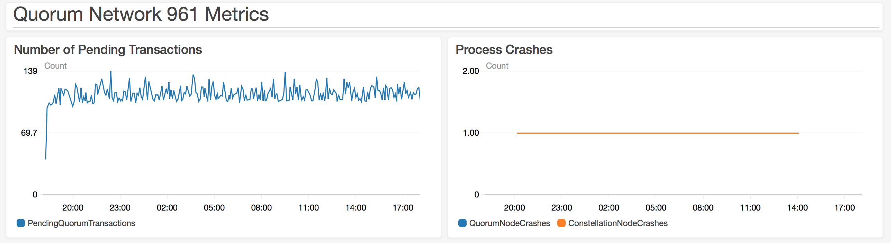

# Test 3: Increased Size
  
## Description

Tests an even larger, multi-region network to determine if a network of this size can stand up.

## Network Properties

### Network Size
| Property             | Value |
| :------------------: | :---: |
| Number of Regions    | 14    |
| Number of Makers     | 89    |
| Number of Validators | 55    |
| Number of Observers  | 1     |

### Network Configuration
| Property                       | Value       |
| :----------------------------: | :---------: |
| Votes to Confirm Block         | 18          |
| Gas Limit Per Block            | 804247552   |
| Block Maker Minimum Block Time | 60 seconds  |
| Block Maker Maximum Block Time | 300 seconds |

### Instance Types
| Property                  | Value     |
| :-----------------------: | :-------: |
| Quorum Node Instance Type | t2.medium |
| Bootnode Instance Type    | t2.small  |

## Test Results

### Overall

### Overall

**SUCCESS**

The network is still running after ~1 day of running

### Details

At any given point there are around 120 Pending transactions. There were 2 instances that emitted metrics indicating a process crash, but no further evidence of crashing was found. The below WARN log statement appeared in the log for one of these instances, though it had no clear effect.

```
2018 Feb-16 09:55:05053949 [WARN] Failed to decode '/check' (GET) request: Not found
```

### Metrics


