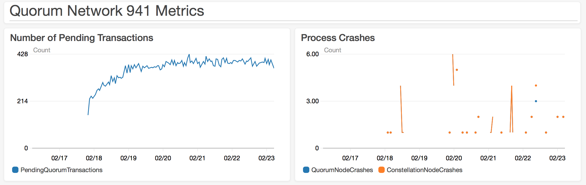

# Test 6: Increased Size
  
## Description

Tests an even larger, multi-region network to determine if a network of this size can stand up.

## Network Properties

### Network Size
| Property             | Value |
| :------------------: | :---: |
| Number of Regions    | 14    |
| Number of Makers     | 233   |
| Number of Validators | 145   |
| Number of Observers  | 1     |

### Network Configuration
| Property                       | Value       |
| :----------------------------: | :---------: |
| Votes to Confirm Block         | 73          |
| Gas Limit Per Block            | 804247552   |
| Block Maker Minimum Block Time | 60 seconds  |
| Block Maker Maximum Block Time | 300 seconds |

### Instance Types
| Property                  | Value     |
| :-----------------------: | :-------: |
| Quorum Node Instance Type | t2.medium |
| Bootnode Instance Type    | t2.small  |

## Test Results

### Overall

**SUCCESS**

The network is still running after ~5 days of running

### Details

At any given point there are around 380 Pending transactions. There were instances that emitted metrics indicating a process crash, but no further evidence of crashing was found.

The following logs were found, suggesting that at some point, credentials are lost, probably while being refreshed. This seems to cause a process crash metric, though it cannot be completely separated from the other sporadic occurrences of this.

```
unexpected exit, emitting cloudwatch metric
Traceback (most recent call last):
  File "/opt/quorum/bin/crashcloudwatch.py", line 184, in <module>
    main()
  File "/opt/quorum/bin/crashcloudwatch.py", line 180, in main
    prog.runforever()
  File "/opt/quorum/bin/crashcloudwatch.py", line 123, in runforever
    self.emit_metric(self.metric)
  File "/opt/quorum/bin/crashcloudwatch.py", line 139, in emit_metric
    self.client.put_metric_data(Namespace=namespace, MetricData=metric_data)
  File "/usr/local/lib/python2.7/dist-packages/botocore/client.py", line 324, in _api_call
    return self._make_api_call(operation_name, kwargs)
  File "/usr/local/lib/python2.7/dist-packages/botocore/client.py", line 609, in _make_api_call
    operation_model, request_dict)
  File "/usr/local/lib/python2.7/dist-packages/botocore/endpoint.py", line 143, in make_request
    return self._send_request(request_dict, operation_model)
  File "/usr/local/lib/python2.7/dist-packages/botocore/endpoint.py", line 168, in _send_request
    request = self.create_request(request_dict, operation_model)
  File "/usr/local/lib/python2.7/dist-packages/botocore/endpoint.py", line 152, in create_request
    operation_name=operation_model.name)
  File "/usr/local/lib/python2.7/dist-packages/botocore/hooks.py", line 227, in emit
    return self._emit(event_name, kwargs)
  File "/usr/local/lib/python2.7/dist-packages/botocore/hooks.py", line 210, in _emit
    response = handler(**kwargs)
  File "/usr/local/lib/python2.7/dist-packages/botocore/signers.py", line 90, in handler
    return self.sign(operation_name, request)
  File "/usr/local/lib/python2.7/dist-packages/botocore/signers.py", line 148, in sign
    auth = self.get_auth_instance(**kwargs)
  File "/usr/local/lib/python2.7/dist-packages/botocore/signers.py", line 227, in get_auth_instance
    frozen_credentials = self._credentials.get_frozen_credentials()
  File "/usr/local/lib/python2.7/dist-packages/botocore/credentials.py", line 507, in get_frozen_credentials
    self._refresh()
  File "/usr/local/lib/python2.7/dist-packages/botocore/credentials.py", line 415, in _refresh
    self._protected_refresh(is_mandatory=is_mandatory_refresh)
  File "/usr/local/lib/python2.7/dist-packages/botocore/credentials.py", line 446, in _protected_refresh
    self._set_from_data(metadata)
  File "/usr/local/lib/python2.7/dist-packages/botocore/credentials.py", line 465, in _set_from_data
    self.access_key = data['access_key']
KeyError: 'access_key'
unexpected exit, emitting cloudwatch metric
unexpected exit, emitting cloudwatch metric
unexpected exit, emitting cloudwatch metric
unexpected exit, emitting cloudwatch metric
```

### Metrics


