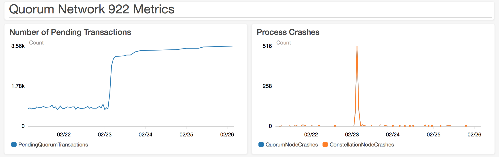

# Test 7: Increased Size
  
## Description

Tests an even larger, multi-region network to determine if a network of this size can stand up.

## Network Properties

### Network Size
| Property             | Value |
| :------------------: | :---: |
| Number of Regions    | 14    |
| Number of Makers     | 377   |
| Number of Validators | 233   |
| Number of Observers  | 1     |

### Network Configuration
| Property                       | Value       |
| :----------------------------: | :---------: |
| Votes to Confirm Block         | 117         |
| Gas Limit Per Block            | 804247552   |
| Block Maker Minimum Block Time | 60 seconds  |
| Block Maker Maximum Block Time | 300 seconds |

### Instance Types
| Property                  | Value     |
| :-----------------------: | :-------: |
| Quorum Node Instance Type | t2.medium |
| Bootnode Instance Type    | t2.small  |

## Test Results

### Overall

**FAILURE**

A majority of validators crashed, stalling the network. This was caused by running out of memory on instances to store new blocks.

### Details

The following was found in the geth log, indicating that the main file system ran out of space

```
F0223 08:05:19.838549 core/database_util.go:422] failed to store block receipts into database: write /home/ubuntu/.ethereum/geth/chaindata/376127.log: no space left on device
```

We confirmed that the file system is full

```
ubuntu@ip-10-0-2-202:~$ df -h
Filesystem      Size  Used Avail Use% Mounted on
udev            2.0G     0  2.0G   0% /dev
tmpfs           396M   26M  370M   7% /run
/dev/xvda1      7.7G  7.7G     0 100% /
tmpfs           2.0G     0  2.0G   0% /dev/shm
tmpfs           5.0M     0  5.0M   0% /run/lock
tmpfs           2.0G     0  2.0G   0% /sys/fs/cgroup
tmpfs           396M     0  396M   0% /run/user/1000
```

The next test will be run on the same network size with increased space on the file system

### Metrics


