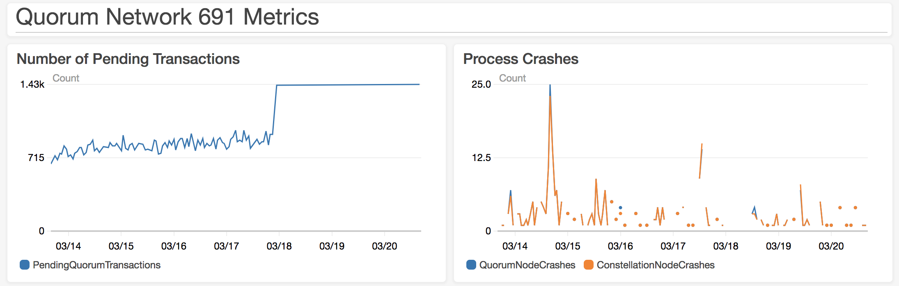

# Test 8: Bigger File System

## Description

Tests the same size network with more file system memory to see if this network can stand up.

## Network Properties

### Network Size
| Property             | Value |
| :------------------: | :---: |
| Number of Regions    | 14    |
| Number of Makers     | 377   |
| Number of Validators | 233   |
| Number of Observers  | 1     |

### Network Configuration
| Property                       | Value       |
| :----------------------------: | :---------: |
| Votes to Confirm Block         | 117         |
| Gas Limit Per Block            | 804247552   |
| Block Maker Minimum Block Time | 60 seconds  |
| Block Maker Maximum Block Time | 300 seconds |

### Instances
| Property                  | Value     |
| :-----------------------: | :-------: |
| Quorum Node Instance Type | t2.medium |
| Bootnode Instance Type    | t2.small  |
| Root File System Size     | 50 GB     |

## Test Results

### Overall

**FAILURE**

A majority of validators crashed, stalling the network. Geth nodes seem to be running out of memory.

### Details

The following was found in the geth log, indicating a crash caused by running out of memory.

```
fatal error: runtime: out of memory

runtime stack:
runtime.throw(0xe7015c, 0x16)
	/usr/local/go/src/runtime/panic.go:566 +0x95
runtime.sysMap(0xc4ec5e0000, 0x2000000, 0x0, 0x177f778)
	/usr/local/go/src/runtime/mem_linux.go:219 +0x1d0
runtime.(*mheap).sysAlloc(0x17657c0, 0x2000000, 0x1765ab8)
	/usr/local/go/src/runtime/malloc.go:407 +0x37a
runtime.(*mheap).grow(0x17657c0, 0x1000, 0x0)
	/usr/local/go/src/runtime/mheap.go:726 +0x62
runtime.(*mheap).allocSpanLocked(0x17657c0, 0x1000, 0x7f51df96acc8)
	/usr/local/go/src/runtime/mheap.go:630 +0x4f2
runtime.(*mheap).alloc_m(0x17657c0, 0x1000, 0x100000000, 0x43276b)
	/usr/local/go/src/runtime/mheap.go:515 +0xe0
runtime.(*mheap).alloc.func1()
	/usr/local/go/src/runtime/mheap.go:579 +0x4b
runtime.systemstack(0x7f51f8f94e18)
	/usr/local/go/src/runtime/asm_amd64.s:314 +0xab
runtime.(*mheap).alloc(0x17657c0, 0x1000, 0x10100000000, 0x2d)
	/usr/local/go/src/runtime/mheap.go:580 +0x73
runtime.largeAlloc(0x2000000, 0x7f51fdc17001, 0x2d)
	/usr/local/go/src/runtime/malloc.go:774 +0x93
runtime.mallocgc.func1()
	/usr/local/go/src/runtime/malloc.go:669 +0x3e
runtime.systemstack(0xc420016000)
	/usr/local/go/src/runtime/asm_amd64.s:298 +0x79
runtime.mstart()
	/usr/local/go/src/runtime/proc.go:1079
```

The symptoms seem about the same as [this GitHub issue](https://github.com/ethereum/go-ethereum/issues/15157), though that issue refers to geth 1.7 in particular. Memory may be running out due to issues involved in scaling the network.

Some potential solutions to scaling further may be:
* Using larger instances with more memory
* Enabling swap file

### Metrics


