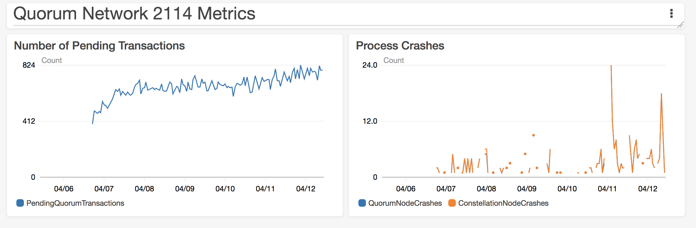

# Test 8: Bigger File System

## Description

Tests the same size network with a swapfile activated to see if we can stand up a network of this size.

## Network Properties

### Network Size
| Property             | Value |
| :------------------: | :---: |
| Number of Regions    | 14    |
| Number of Makers     | 377   |
| Number of Validators | 233   |
| Number of Observers  | 1     |

### Network Configuration
| Property                       | Value       |
| :----------------------------: | :---------: |
| Votes to Confirm Block         | 117         |
| Gas Limit Per Block            | 804247552   |
| Block Maker Minimum Block Time | 60 seconds  |
| Block Maker Maximum Block Time | 300 seconds |

### Instances
| Property                  | Value     |
| :-----------------------: | :-------: |
| Quorum Node Instance Type | t2.medium |
| Bootnode Instance Type    | t2.small  |
| Root File System Size     | 50 GB     |

## Test Results

### Overall

**SUCCESS**

The network is still running after ~5 days of running. The swapfile seems to fix the out of memory issue.

### Details

At any given point there are around 800 Pending transactions. The process crash metric is still noisy.

### Metrics

